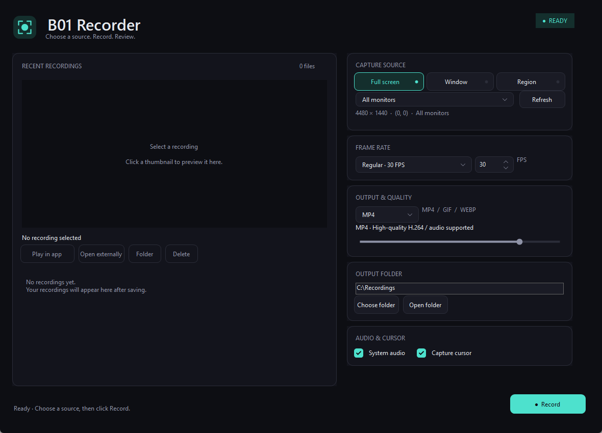

# B01 Recorder

A minimal screen recorder for Windows. Capture your full screen, a window, or a selected region as **MP4 · GIF · WebP**.

[**View latest release**](https://github.com/BE0X01/b01-recorder/releases/latest)

## Preview

## Features

- **Three capture modes** — full screen, individual window, or selected region
- **MP4 · GIF · WebP** — adjustable quality for GIF and WebP
- **Frame rate controls** — 30 / 60 / 15 / 10 FPS presets and custom rates from 1 to 120 FPS
- **System audio** — include PC audio in MP4 recordings, with optional cursor capture
- **Clear capture outlines** — teal borders without dimming the desktop
- **Recording library** — thumbnails, in-app previews, external playback, folder access, and Recycle Bin deletion
- **Portable storage** — settings and caches stay beside the executable

## Getting started

1. Download the ZIP from the latest release and extract it.
2. Run `Install-FFmpeg.cmd` to download FFmpeg directly from its distributor. The script verifies the download before placing `ffmpeg.exe` and `ffprobe.exe` beside the app. Alternatively, download the [essentials build](https://www.gyan.dev/ffmpeg/builds/) yourself and copy those two files into the app folder.
3. Run `b01-recorder.exe`.
4. Choose `Full screen`, `Window`, or `Region`, then select your capture target.
5. Set the output format, frame rate, quality, and output folder. Recordings save to your Desktop by default.
6. Click `Record` to start. The same button changes to `Stop & save`; click it to finish and save.

**Selecting a capture target does not start recording.** The app stays visible when recording begins.

Select a thumbnail to preview a saved recording. Use `Play in app` for in-app playback or `Open externally` to open it in your default player. `Delete` moves the file to the Recycle Bin after confirmation.

## Requirements and storage

Supports Windows 10/11 **x64**. The .NET runtime is included. FFmpeg is obtained separately using the setup step above. In-app previews require [Microsoft Edge WebView2 Runtime](https://developer.microsoft.com/microsoft-edge/webview2/).

| Item | Location |
| --- | --- |
| Recordings | Your chosen folder; Desktop by default |
| Last-used settings | `setting.ini` beside the executable; saved once when the app exits |
| Thumbnails and player cache | The `data` folder beside the executable |

System audio is supported in MP4 recordings. Keep the target window restored during window capture. Long GIF or WebP recordings may take time to save.

## License

[MIT](LICENSE). See [Third-party notices](THIRD-PARTY-NOTICES.md) for licenses covering FFmpeg and other included components.
